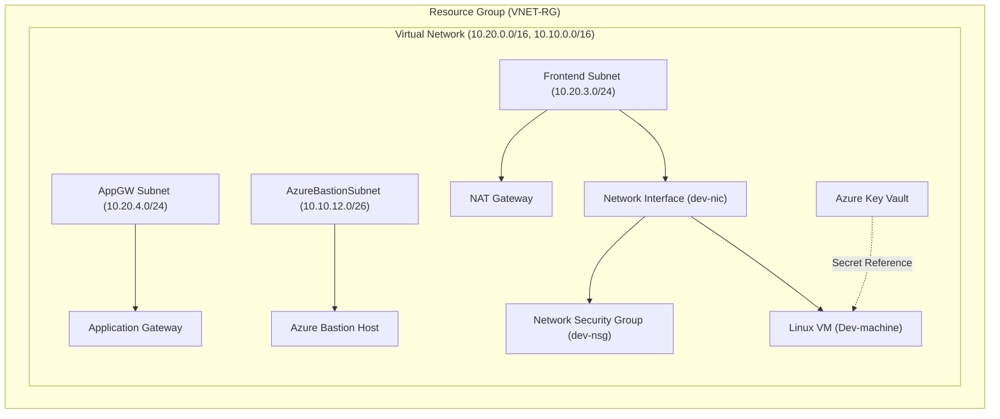

# Azure Infrastructure Landing Zone with Terraform & GitHub Actions


## 📌 Project Overview

This repository contains a modular **Azure Landing Zone Infrastructure as Code (IaC)** solution built with **Terraform** using a **Child & Parent Module** pattern. It provides automated, secure, and repeatable deployments of core Azure infrastructure components across environment layers (`dev`, `prod`).

The repository is integrated with automated **GitHub Actions pipelines** for Continuous Integration (linting, validation, security scanning with Trivy, cost estimation with Infracost) and Continuous Deployment (plan & apply to Azure).

---

## 📁 Repository Directory Tree

```
Latest-Landing-Zone-infra/
├── .github/
│   └── workflows/
│       ├── terraform.yml          # CI Pipeline (Fmt, Validate, TFLint, Trivy, Plan, Infracost, Test)
│       └── terraform_CD.yml       # CD Pipeline (Automated Azure Login, Plan & Apply)
├── Module/                        # Reusable Child Modules
│   ├── azurerm_NIC/               # Network Interface Card Module
│   ├── azurerm_NIC+NSG_Assocition/# NIC to Security Group Association Module
│   ├── azurerm_NSG/               # Network Security Group Module
│   ├── azurerm_PublicIP/          # Public IP Address Module
│   ├── azurerm_Virtual_Machine/   # Linux Virtual Machine Module
│   ├── azurerm_application_gateway/ # Azure Application Gateway Module
│   ├── azurerm_bastion/           # Azure Bastion Host Module
│   ├── azurerm_key_vault/         # Azure Key Vault & Secret Management Module
│   ├── azurerm_nat_gateway/       # Azure NAT Gateway Module
│   ├── azurerm_resource_group/    # Resource Group Module
│   ├── azurerm_subnet/            # Subnet Module
│   └── azurerm_virtual_network/   # Virtual Network Module
├── environment/                   # Environment Configurations (Parent Modules)
│   ├── dev/                       # Development Environment Setup
│   │   ├── .terraform.lock.hcl
│   │   ├── backend.conf           # Backend Azure Blob Storage Configuration
│   │   ├── backend.tf             # Terraform Remote Backend definition
│   │   ├── main.tf                # Parent Module Invocations & Dependencies
│   │   ├── output.tf              # Terraform Outputs (e.g., Key Vault secrets reference)
│   │   ├── provider.tf            # Provider configuration (AzureRM ~> 4.76.0)
│   │   ├── terraform.tfvars       # Environment Input Variable Values
│   │   └── variable.tf            # Variable Definitions
│   └── prod/                      # Production Environment (Placeholder for Prod setup)
├── .gitignore                     # Git Ignore File
└── README.md                      # Project Documentation
```

---

## 🏗️ Architecture & Azure Infrastructure Components

The infrastructure deploys a secure Azure Landing Zone topology:



Key Azure Resources Provisioned:
- **Resource Group**: Centralized management container for all environment resources.
- **Virtual Network (VNet) & Subnets**: Multi-tier network architecture including Frontend, App Gateway, and Azure Bastion subnets.
- **Network Security Group (NSG)**: Inbound/outbound security filtering rules (e.g., SSH port 22 control).
- **Network Interface (NIC) & Security Group Association**: Binds NSGs dynamically to NICs.
- **Azure Bastion Host**: Secure, seamless RDP/SSH connectivity directly via Azure Portal without exposing public management ports.
- **Azure Key Vault**: Secure storage for VM administrative credentials and sensitive values.
- **Linux Virtual Machine (Ubuntu 22.04 LTS)**: Compute instance configured with dynamic credential fetching from Key Vault.
- **NAT Gateway**: Provides outbound internet connectivity for private subnet instances.
- **Application Gateway**: Layer 7 load balancer with HTTP listener and backend routing rules.

---

## 🚀 Getting Started & Local Usage

### Prerequisites
- [Terraform](https://www.terraform.io/downloads) `v1.14.0` or higher
- [Azure CLI](https://docs.microsoft.com/en-us/cli/azure/install-azure-cli) installed and authenticated (`az login`)
- Azure Subscription with appropriate RBAC roles (Contributor / Owner)

### Execution Steps

1. **Clone the Repository**:
   ```bash
   git clone https://github.com/arjunxmishra525/Latest-Landing-Zone-infra.git
   cd Latest-Landing-Zone-infra/environment/dev
   ```

2. **Initialize Terraform**:
   ```bash
   terraform init
   ```
   *(To use remote state backend, uncomment lines in `backend.tf` or pass `-backend-config=backend.conf`)*

3. **Format & Validate Code**:
   ```bash
   terraform fmt -recursive
   terraform validate
   ```

4. **Review Execution Plan**:
   ```bash
   terraform plan -var-file="terraform.tfvars"
   ```

5. **Deploy Infrastructure**:
   ```bash
   terraform apply -var-file="terraform.tfvars"
   ```

---

## 🔄 CI/CD Automation (GitHub Actions)

This repository includes two GitHub Actions workflows located in `.github/workflows/`:

### 1. Continuous Integration (`terraform.yml`)
Triggers on pushes to `feature` branches and Pull Requests to `main`.
- **Build**: `terraform init`, `terraform fmt`, `terraform validate`
- **Security Scan**: `tflint` for code quality & `trivy` for IaC security vulnerability scanning
- **Plan**: Authenticates with Azure using GitHub Secrets (`secrets.login`) and generates `tfplan`
- **Cost Estimation**: Runs `infracost` to calculate breakdown of monthly cloud expenses
- **Testing**: Runs native `terraform test` suite

### 2. Continuous Deployment (`terraform_CD.yml`)
Triggers on merged commits to `main`.
- Performs Terraform Init and generates an environment Plan artifact
- Requires approval / environment gates under GitHub Environments (`Production`)
- Executes automated `terraform apply` using saved plan file

---

## 🔍 Code Review & Best Practices Recommendations

Following an analysis of the repository's codebase, here are key observations and recommended improvements:

| Category | Observation | Recommended Action |
| :--- | :--- | :--- |
| 🔒 **Security** | Plaintext credentials in `terraform.tfvars` and fallback default in `azurerm_key_vault/main.tf`. | Remove sensitive secrets from `terraform.tfvars`. Use environment variables (`TF_VAR_...`), Azure Key Vault random password generation (`random_password` resource), or GitHub Secrets. |
| 🔒 **Git Hygiene** | `terraform.tfvars` contains environment secrets and is currently tracked in git. | Add `*.tfvars` to `.gitignore` to prevent secret leaks to version control. |
| ☁️ **State Management** | Remote backend configurations in `backend.tf` & `backend.conf` are currently commented out. | Uncomment and configure remote state storage (Azure Storage Container `tfstate`) with state locking to prevent concurrent state corruption. |
| ✏️ **Naming Conventions** | Directory named `azurerm_NIC+NSG_Assocition` contains a minor typo (`Assocition`). Typo in `dev-vent-arjun-private` (`vent` instead of `vnet`). | Standardize directory and variable names for consistency. |
| 🧩 **Modular Flexibility** | `azurerm_PublicIP` creates two hardcoded resources (`publicip1` and `publicip2`). | Refactor to dynamic `for_each` over map objects so any number of Public IPs can be provisioned cleanly. |

---

## 📜 License
This repository is maintained for Azure Landing Zone Infrastructure deployments.